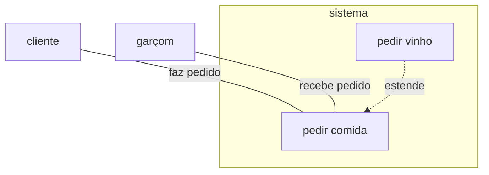

# trabalho-engenharia-software-2026
Trabalho de clínica veterinária do Técnico em Informática, segundo semestre de 2026.

Link do projeto do Figma:
https://www.figma.com/proto/daZmTMeXfA2XVBkE5mni0Y/meu-projeto?node-id=145-332&starting-point-node-id=145%3A332&t=9yZ8tkHPclGnqlpo-1

## Diagrama UML 
## Diagramas de caso de uso

